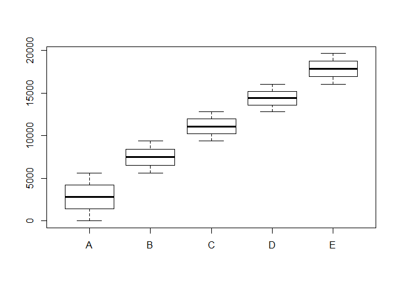
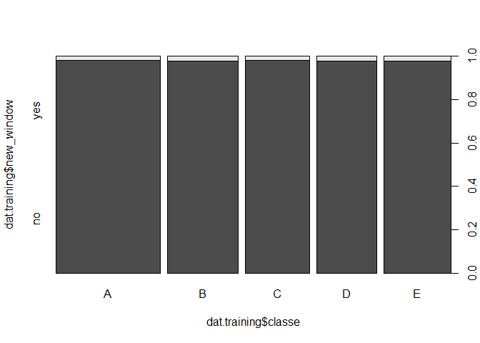
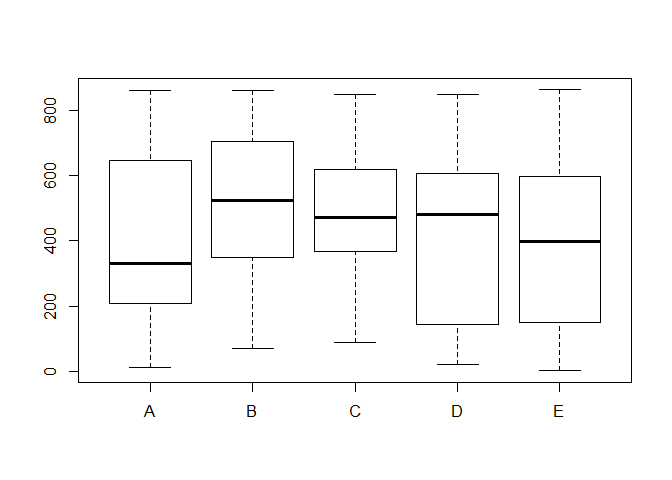

# Predicting Activity Quality from Activity Monitors

## Synopsis

The objective is to use machine learning to predict activity quality from activity monitors. The data used for this project is obtained through the machine learning coursera course from JHU. The online reference is: <http://groupware.les.inf.puc-rio.br/har>


## Data

#### Data download
Data is download from the Coursera site and saved locally which is then read into R. Since data is not clean, and care must be taken to distinguish improbable data.


```r
# uncomment to download to and read from local file
#
#urlTrain <- "http://d396qusza40orc.cloudfront.net/predmachlearn/pml-training.csv"
#urlTest <- "http://d396qusza40orc.cloudfront.net/predmachlearn/pml-testing.csv"
#download.file(urlTrain, destfile="datTrain.csv")
#download.file(urlTest, destfile="datTest.csv")

dat.training <- read.csv("datTrain.csv", na.strings = c("NA"," ","#DIV/0!"), strip.white=T)
```


#### Data exploration

Here are some of the observations on the data:

- Initial exploration of training data as shown by the first graph shows that quality of data (variable `classe`) is a function of data series (variable `X`), which does not really make sense. There are other irrelevant data also, which will be culled later.

```r
sapply(levels(dat.training$classe), function(x) nrow(subset(dat.training,dat.training$classe==x)))
```

```
##    A    B    C    D    E 
## 5580 3797 3422 3216 3607
```


- Similarly, the variable `new_window` is uniformly distributed over `classe` and therefore, we can disregard this variable for prediction. This is shown in the second figure.

- Variables like time-stamps and usernames are also irrelevant to prediction.


```r
boxplot(dat.training$X ~ dat.training$classe) 
```

 

```r
plot(dat.training$new_window ~ dat.training$classe)
```

 

```r
boxplot(dat.training$num_window ~ dat.training$classe)
```

 

- There are also a large number of variables with missing values. Since more than 95% of the data is missing in the variables, there is not sensible way to impute the data. Hence such variables are also removed from the training data.

These data manipulations are shown in the next section. The third figure shows a box plot one of the many variables that affect `classe`.

## Data Manipulation

First of all, the variables with improbable data and incorrect formats are eliminated. Then, 91 variables with more than 95% missing data is removed. Finally, the clean training data set has 19622 rows and 54 columns (including `classe`).


```r
# serial number, usernametime stamps, and other zero variables can be removed
names <- data.frame(names(dat.training))
colNameNuseful <- c("X", "user_name", "raw_timestamp_part_1", "raw_timestamp_part_2",
                  "cvtd_timestamp", "new_window", "kurtosis_yaw_belt", "skewness_yaw_belt",
                  "amplitude_yaw_belt", "kurtosis_yaw_dumbbell", "skewness_yaw_dumbbell",
                  "amplitude_yaw_dumbbell", "kurtosis_yaw_forearm", "skewness_yaw_forearm",
                  "amplitude_yaw_forearm")
colNuseful <- sapply(colNameNuseful, function(x) which(names==x))
  # unlist(colNuseful) = c(1:6,14,17,26,89,92,127,130,139)
training <- dat.training[,-unlist(colNuseful)]

# remove columns with NA values 
colNA <- sapply(1:ncol(training), 
                function(x) ifelse(is.na(summary(training[,x])[7]),TRUE,FALSE) ) 
# Columns with more than 95% missing data
sum(colNA==FALSE)
```

```
## [1] 91
```

```r
training <- training[,colNA]
    # dim(training) gives 19622 rows and 54 columns

require(caret)
require(randomForest)
require(rpart)
```


## Model

For the model, first a random sample of 20 rows is taken as a test set (similar to the quiz set in the Netflix competition). The rest of the training dataset is used for training.

## Creating testing and training data

```r
set.seed(6834)

index.test <- sample(1:nrow(training),size=20)
dat.test <- training[index.test,]
dat.train <- training[-index.test,]
```


#### Using randomForest algorithm on training data

```r
rf <- randomForest(classe ~ ., data = dat.train, ntree = 500) 
confusionMatrix(dat.test$classe,predict(rf,dat.test[-ncol(dat.test)]))
```

```
## Confusion Matrix and Statistics
## 
##           Reference
## Prediction A B C D E
##          A 5 0 0 0 0
##          B 0 4 0 0 0
##          C 0 0 3 0 0
##          D 0 0 0 5 0
##          E 0 0 0 0 3
## 
## Overall Statistics
##                                      
##                Accuracy : 1          
##                  95% CI : (0.8316, 1)
##     No Information Rate : 0.25       
##     P-Value [Acc > NIR] : 9.095e-13  
##                                      
##                   Kappa : 1          
##  Mcnemar's Test P-Value : NA         
## 
## Statistics by Class:
## 
##                      Class: A Class: B Class: C Class: D Class: E
## Sensitivity              1.00      1.0     1.00     1.00     1.00
## Specificity              1.00      1.0     1.00     1.00     1.00
## Pos Pred Value           1.00      1.0     1.00     1.00     1.00
## Neg Pred Value           1.00      1.0     1.00     1.00     1.00
## Prevalence               0.25      0.2     0.15     0.25     0.15
## Detection Rate           0.25      0.2     0.15     0.25     0.15
## Detection Prevalence     0.25      0.2     0.15     0.25     0.15
## Balanced Accuracy        1.00      1.0     1.00     1.00     1.00
```

caretnb <- train(dat.train$classe ~ ., data=dat.train, method="nb")
caretlda <- train(dat.train$classe ~ ., data=dat.train, method="lda")

fit.rf <- randomForest(dat.train$classe ~ ., data=dat.train, prox=TRUE)
confusionMatrix(dat.test$classe,predict(fit.rf,dat.test[-ncol(dat.test)]))


inTrain <- createDataPartition(dat.train$classe, p=.75, list=F)
train <- dat.train[inTrain,]

caretrf <- train(train$classe ~ ., data=train, 
                    method="rf", prox=TRUE,
                    trControl = trainControl(method="repeatedcv", repeats=3))

caretrpart <- train(dat.train$classe ~ ., data=dat.train, method="rpart")
confusionMatrix(dat.test$classe, predict(caretrpart,dat.test[-ncol(dat.test)]))


cvCtrl <- trainControl(method = "repeatedcv", repeats = 3)
train(Class ~ ., data = training, method = "rpart",
        tuneLength = 30,
        trControl = cvCtrl)

#### Cross-validation

#### Expected output sample error


## Prediction on Testing

#### Reading and preparing test data set

```r
dat.testing <- read.csv("datTest.csv", na.strings = c("NA"," ","#DIV/0!"), strip.white=T)

testing <- dat.testing[,-unlist(colNuseful)]
testing <- testing[,colNA]
```

Running the prediction model on testing data, we get:

```r
require(randomForest)
answers <- as.character(predict(rf,testing[-ncol(testing)]))
answers
```

```
##  [1] "B" "A" "B" "A" "A" "E" "D" "B" "A" "A" "B" "C" "B" "A" "E" "E" "A"
## [18] "B" "B" "B"
```

```r
  # answers = "B" "A" "B" "A" "A" 
  #           "E" "D" "B" "A" "A"
  #           "B" "C" "B" "A" "E"
  #           "E" "A" "B" "B" "B"
```


#### Submission

```r
pml_write_files = function(x){
  n = length(x)
  for(i in 1:n){
    filename = paste0("output_submission/problem_id_",i,".txt")
    write.table(x[i],file=filename,quote=FALSE,row.names=FALSE,col.names=FALSE)
  }
}

pml_write_files(answers)
```

## Conclusion


